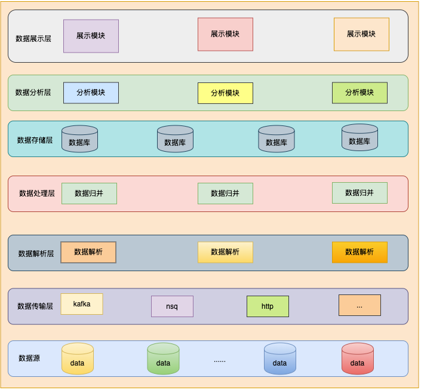

# github.com/xiebingnote/go-gin-project

基于 Gin 进行模块化设计的 API 框架，封装了常用的功能，包括熔断限流，性能监控，日志，消息队列，数据库等，使用简单，致力于进行快速的业务研发。

仅供参考学习，线上请谨慎使用！！！

### 1、集成组件：

1. 支持 rate 令牌桶限流
2. 支持 redis + lua 分布式限流
3. 支持 JWT 鉴权管理
4. 支持 Casbin 权限管理
5. 支持 zap 日志收集
6. 支持 toml 配置文件解析
7. 支持 gorm 数据库组件
8. 支持 go-redis 组件
9. 支持 MySQL, Postgresql 关系型数据库
10. 支持 ElasticSearch, MongoDB 非关系型数据库
11. 支持 Clickhouse 列式数据库
12. 支持 Redis, Etcd 缓存数据库
13. 支持 Kafka, NSQ 消息队列
14. 支持 RESTful API 返回值规范
15. 支持 pprof 性能剖析
16. 支持 Prometheus 指标记录
17. 支持 manticore search 搜索引擎
18. 支持 TDengine 时序数据库
19. 支持 protobuf 序列化
20. 支持 Makefile 编译
21. 支持 Docker 容器化
22. 支持 熔断器

### 待添加完善：

1. 各组件 Prometheus 监控指标

## 2、项目结构：
    .
    ├── Dockerfile              # dockerfile
    ├── Makefile                # makefile
    ├── README.md               # readme
    ├── bin                     # 编译后的可执行文件存放目录    
    │   └── bin.md
    ├── bootstrap               # 启动配置文件夹
    │   ├── bootstrap.go        # 启动文件
    │   ├── config.go           # 配置文件
    │   ├── service             # service文件夹：初始化各类服务组件
    │   └── task.go             # 定时任务
    ├── conf                    # 配置文件文件夹
    │   ├── log                 # 日志配置文件夹
    │   │   └── log.toml
    │   ├── server.toml         # server服务配置文件
    │   └── service             # service文件夹：各类服务组件配置
    ├── docker                  # docker相关配置
    │   ├── docker-compose.yml  # docker-compose配置
    │   └── manticore-init.sql  # manticore初始化sql
    ├── go.mod
    ├── go.sum
    ├── library                 # library文件夹
    │   ├── common              # 公共组件
    │   │   ├── cmap.go         # cmap
    │   │   ├── const.go        # 公共常量
    │   │   ├── eventsource.go  # eventsource 事件源
    │   │   ├── mapset.go       # mapset集合
    │   │   ├── serialize.go    # serialize 序列化
    │   │   ├── stack.go        # stack 栈
    │   │   └── time.go         # 时间相关函数
    │   ├── config              # config文件夹：各类组件配置结构目录
    │   ├── middleware          # 中间件目录
    │   │   ├── casbin.go       # casbin 权限管理
    │   │   ├── jwt.go          # jwt 权限管理
    │   │   ├── limiter.go      # 限流中间件
    │   │   └── prometheus.go   # prometheus 监控
    │   ├── request             # 请求组件
    │   │   └── request.go
    │   ├── resource            # 资源组件
    │   │   └── resource.go
    │   └── response            # 响应组件
    │       └── response.go
    ├── log                     # 日志文件存放目录
    ├── main.go                 # 项目启动 main 文件
    ├── model                   # 数据模型文件夹
    │   ├── dao                 # dao层文件夹
    │   ├── service             # service层
    │   └── types               # 类型定义文件夹
    │       └── common.go       # 公共类型定义
    ├── pkg                     # 公共组件文件夹
    │   ├── logger              # 日志组件
    │   │   └── logger.go
    │   ├── proto               # protobuf
    │   │   └── proto.md
    │   └── shutdown            # 关闭服务
    │       └── shutdown.go
    └── servers                 # 服务目录
        ├── httpserver          # http服务
        │   ├── auth            # 认证模块
        │   │   ├── casbin      # casbin 权限管理目录
        │   │   └── jwt         # jwt 权限管理目录
        │   ├── controller      # 业务实现层目录
        │   │   └── router.go   # 业务逻辑路由
        │   ├── router.go       # 服务层路由
        │   └── server.go       # gin 服务入口
        └── start.go            # 启动服务

## 3、架构图：

项目整体架构如下所示：

### 说明：

架构整体自底向上，共分为7层，根据实际情况，自行选择合适的组件，添加对应的处理逻辑。

1. 数据源：实际业务场景的数据来源，接收的数据可能不同，需要根据实际情况进行修改。
2. 数据传输层：数据源与数据解析层之间的数据传输层，一般使用消息队列进行数据传输，如kafka，nsq，也可使用其他的消息队列，如rabbitmq，mqtt等，请自行添加对应的消息队列组件，也可使用http进行数据传输。
3. 数据解析层：对数据传输层接收到的数据，进行分类解析，请自行添加实现对应的解析逻辑组件。
4. 数据处理层：对解析后的数据进行业务处理，根据实际业务，对数据分类后的数据进行处理，归并，聚合等，请自行添加实现对应的处理逻辑组件。
5. 数据存储层：对处理后的数据进行存储，根据业务逻辑，存储到不同的库中，根据实际情况，选择不同的数据库进行存储，如mysql，mongodb，ElasticSearch等，请自行添加实现对应的存储逻辑组件。
6. 数据分析层：对存储在各个库中的数据，进行实际的业务逻辑处理，请自行添加实现对应的分析逻辑组件。
7. 数据展示层：对分析后的数据进行展示，根据业务逻辑，展示到不同的页面，如web页面，app页面，小程序页面等，请自行添加实现对应的展示逻辑组件。