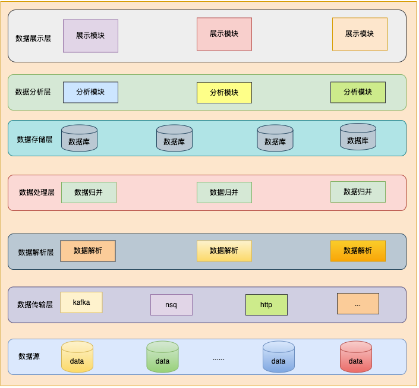

# github.com/xiebingnote/go-gin-project

基于 Gin 进行模块化设计的 API 框架，封装了常用的功能，包括熔断限流，性能监控，日志，消息队列，数据库等，使用简单，致力于进行快速的业务研发。

仅供参考学习，线上请谨慎使用！！！

### 启动、管理端口与退出

- 启动时先绑定业务端口和管理端口；任何一个绑定失败都会释放已绑定的端口，并以非零状态退出。运行期间的监听错误也会触发退出和清理。
- `conf/server.toml` 中的 `AdminServer.Listen` 必须使用回环 IP，默认 `127.0.0.1:8081`，也支持 `[::1]:8081`。旧配置中的 `0.0.0.0:8081` 会被拒绝。管理接口按实际连接来源限制本机访问，不信任客户端提交的转发头。
- `Options.EnablePprof = false` 时不注册调试接口；`Options.EnableMetrics = false` 时不注册 `/metrics`。需要跨主机访问时，使用 SSH 隧道或带认证和访问限制的本机反向代理。
- 收到 `SIGINT` 或 `SIGTERM` 后，先停止并等待后台监控任务，再等待两个 HTTP 服务关闭，最后清理共享资源。HTTP 关闭共用 10 秒期限，资源清理使用独立的 15 秒 context；资源关闭函数需遵守该 context。
- HTTP 关闭超时时会强制关闭连接、保留可能仍被请求使用的共享资源，并以非零状态退出。初始化 panic、启动失败和资源清理错误同样返回非零状态。
- `servers/httpserver/server.go` 在创建每个 HTTP 服务时初始化一个共享熔断器管理器，通过 `CustomCircuitBreakerMiddleware` 挂载到 `/web/api` 业务路由，位于鉴权、限流之后，业务路由注册之前。所有服务创建入口均经过这一步，实例间不共享熔断状态。每个 HTTP 方法和路由模板独立统计：默认 60 秒窗口内至少 20 次请求且失败率达到 60% 时熔断，拒绝后续请求并返回 503；30 秒后进入半开状态，最多接受 10 个探测请求。业务 5xx 和 panic 计为失败，4xx 不计为失败。登录、注册和管理接口不经过该熔断器；参数可在 `setupAPIMiddleware` 调用处通过 `CircuitBreakerConfig` 调整。

### 认证、跨域与限流配置

- 启用 `Options.EnableAuth` 前，通过部署环境的 `JWT_SECRET` 提供至少 32 字节、首尾无空白的随机密钥；可用 `openssl rand -hex 32` 生成后存入部署密钥管理系统。所有实例使用同一密钥，不要提交到仓库。密钥缺失或不合格会阻止认证服务启动；轮换密钥后，旧令牌失效，用户需重新登录。独立调用中间件时须先执行 `middleware.LoadJWTSecretFromEnv()`。
- JWT 和 Casbin 都只接受 HS256、包含有效过期时间和正整数用户 ID 的令牌；Casbin 还要求有效角色。Casbin 模式必须先初始化 `resource.Enforcer` 并配置角色、路径、HTTP 方法策略，无匹配策略返回 403。启动不再写入示例权限或为 `alice` 授予管理员角色；升级时请检查并按需删除数据库中已有的示例授权。公开注册仅创建 `user`，管理员角色需通过受控流程分配。
- JWT 令牌最大为 8 KiB，`Authorization` 头最大为 8 KiB 加 `Bearer ` 前缀长度；在拆分和解析前检查大小，超限返回 401。`ParseToken` 直接调用也执行令牌大小检查。
- `Options.TrustedProxies` 只接受代理 IP 或 CIDR，非法配置阻止启动。空列表（或省略）表示不信任任何代理，客户端 IP 取实际连接地址；仅当连接来自已配置的代理时才接受转发头。
- 启用 `EnableSecurity` 和 `EnableCORS` 时，`CORSAllowedOrigins` 使用精确来源（如 `["https://console.example.com"]`，不带路径），不接受 `*` 或 `null`。空列表拒绝所有跨域来源；无 Origin 或直接连接的同源请求不受影响。TLS 在反向代理终止时，应显式列入浏览器使用的公网来源。`CORSAllowCredentials` 默认为 `false`，仅按需启用。
- `Options.RateLimit` 的 `LoginLimit`、`APILimit`、`PublicLimit` 均为每个 IP 每分钟次数，默认分别为 10、100、50；0 使用默认值，负数配置会被拒绝。登录始终有限流保护；API 限流由 `EnableRedis` 或 `EnableMemory` 启用，与认证开关独立。启用安全中间件时，公共限流同时覆盖登录和业务请求，因此可能先达到公共限额。`UserIDLimiter` 为每个用户持续累计独立计数。
- Redis 未初始化时使用每个进程独立的内存计数，不能提供跨实例总额；Redis 运行中失败返回 503。登录、API 和公共 Redis 计数使用不同键前缀，互不混用。
- 监控将未知 HTTP 方法合并为 `OTHER`；熔断器按已注册路由模板复用，未知路径不创建熔断器，避免客户端输入无限增加指标和内存占用。

相关回归测试（无需外部数据库或 Redis）：

```sh
go test -race -count=1 -timeout=90s . ./servers ./servers/httpserver ./library/middleware ./pkg/circuitbreaker
go test -race pkg/kafka/consumer_group.go pkg/kafka/consumer_group_regression_test.go -timeout 30s
```

Kafka 回归测试直接指定文件，避开原有集成测试中的自动连接；验证同一处理器重复建立消费会话时，就绪通道只关闭一次，无需实际 Kafka 集群。

### 1、集成组件：

1. 支持 rate 令牌桶限流
2. 支持 redis + lua 分布式限流
3. 支持 JWT 鉴权管理
4. 支持 Casbin 权限管理
5. 支持 zap 日志收集
6. 支持 toml 配置文件解析
7. 支持 gorm 数据库组件
8. 支持 go-redis 组件
9. 支持 MySQL, Postgresql 关系型数据库
10. 支持 ElasticSearch, MongoDB 非关系型数据库
11. 支持 Clickhouse 列式数据库
12. 支持 Redis, Etcd 缓存数据库
13. 支持 Kafka, NSQ 消息队列
14. 支持 RESTful API 返回值规范
15. 支持 pprof 性能剖析
16. 支持 Prometheus 指标记录
17. 支持 manticore search 搜索引擎
18. 支持 TDengine 时序数据库
19. 支持 protobuf 序列化
20. 支持 Makefile 编译
21. 支持 Docker 容器化
22. 支持 熔断器

### 待添加完善：

1. 各组件 Prometheus 监控指标

## 2、项目结构：
    .
    ├── Dockerfile              # dockerfile
    ├── Makefile                # makefile
    ├── README.md               # readme
    ├── bin                     # 编译后的可执行文件存放目录    
    │   └── bin.md
    ├── bootstrap               # 启动配置文件夹
    │   ├── bootstrap.go        # 启动文件
    │   ├── config.go           # 配置文件
    │   ├── service             # service文件夹：初始化各类服务组件
    │   └── task.go             # 定时任务
    ├── conf                    # 配置文件文件夹
    │   ├── log                 # 日志配置文件夹
    │   │   └── log.toml
    │   ├── server.toml         # server服务配置文件
    │   └── service             # service文件夹：各类服务组件配置
    ├── docker                  # docker相关配置
    │   ├── docker-compose.yml  # docker-compose配置
    │   └── manticore-init.sql  # manticore初始化sql
    ├── go.mod
    ├── go.sum
    ├── library                 # library文件夹
    │   ├── common              # 公共组件
    │   │   ├── cmap.go         # cmap
    │   │   ├── const.go        # 公共常量
    │   │   ├── eventsource.go  # eventsource 事件源
    │   │   ├── mapset.go       # mapset集合
    │   │   ├── serialize.go    # serialize 序列化
    │   │   ├── stack.go        # stack 栈
    │   │   └── time.go         # 时间相关函数
    │   ├── config              # config文件夹：各类组件配置结构目录
    │   ├── middleware          # 中间件目录
    │   │   ├── casbin.go       # casbin 权限管理
    │   │   ├── jwt.go          # jwt 权限管理
    │   │   ├── limiter.go      # 限流中间件
    │   │   └── prometheus.go   # prometheus 监控
    │   ├── request             # 请求组件
    │   │   └── request.go
    │   ├── resource            # 资源组件
    │   │   └── resource.go
    │   └── response            # 响应组件
    │       └── response.go
    ├── log                     # 日志文件存放目录
    ├── main.go                 # 项目启动 main 文件
    ├── model                   # 数据模型文件夹
    │   ├── dao                 # dao层文件夹
    │   ├── service             # service层
    │   └── types               # 类型定义文件夹
    │       └── common.go       # 公共类型定义
    ├── pkg                     # 公共组件文件夹
    │   ├── logger              # 日志组件
    │   │   └── logger.go
    │   ├── proto               # protobuf
    │   │   └── proto.md
    │   └── shutdown            # 关闭服务
    │       └── shutdown.go
    └── servers                 # 服务目录
        ├── httpserver          # http服务
        │   ├── auth            # 认证模块
        │   │   ├── casbin      # casbin 权限管理目录
        │   │   └── jwt         # jwt 权限管理目录
        │   ├── controller      # 业务实现层目录
        │   │   └── router.go   # 业务逻辑路由
        │   ├── router.go       # 服务层路由
        │   └── server.go       # gin 服务入口
        └── start.go            # 启动服务

## 3、架构图：

项目整体架构如下所示：


### 说明：

架构整体自底向上，共分为7层，根据实际情况，自行选择合适的组件，添加对应的处理逻辑。

1. 数据源：实际业务场景的数据来源，接收的数据可能不同，需要根据实际情况进行修改。
2. 数据传输层：数据源与数据解析层之间的数据传输层，一般使用消息队列进行数据传输，如kafka，nsq，也可使用其他的消息队列，如rabbitmq，mqtt等，请自行添加对应的消息队列组件，也可使用http进行数据传输。
3. 数据解析层：对数据传输层接收到的数据，进行分类解析，请自行添加实现对应的解析逻辑组件。
4. 数据处理层：对解析后的数据进行业务处理，根据实际业务，对数据分类后的数据进行处理，归并，聚合等，请自行添加实现对应的处理逻辑组件。
5. 数据存储层：对处理后的数据进行存储，根据业务逻辑，存储到不同的库中，根据实际情况，选择不同的数据库进行存储，如mysql，mongodb，ElasticSearch等，请自行添加实现对应的存储逻辑组件。
6. 数据分析层：对存储在各个库中的数据，进行实际的业务逻辑处理，请自行添加实现对应的分析逻辑组件。
7. 数据展示层：对分析后的数据进行展示，根据业务逻辑，展示到不同的页面，如web页面，app页面，小程序页面等，请自行添加实现对应的展示逻辑组件。
